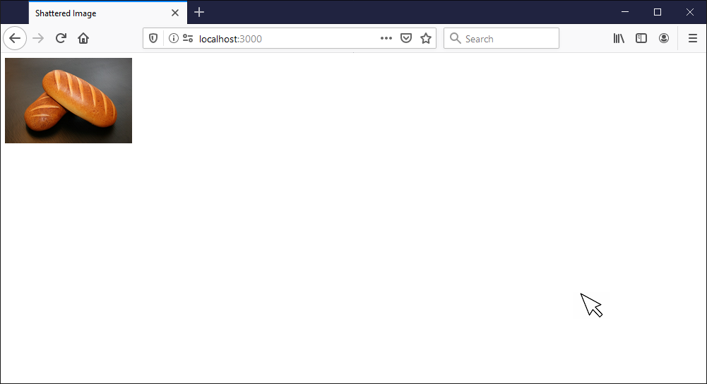
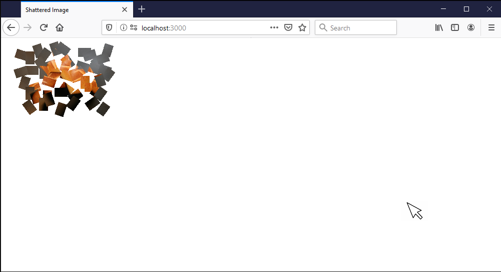

## Shattered Image Effect with React Hook
It is a tiny(100 lines of code) fun project using React Hook. Basically what it do is fragmentizing an image, scatter the image pieces, then restore the parts back to a whole image at the position of your choice.

Double Click on a point in the browser

Image starts shattering

Image fragments move and rotation randomly toward target point

Parts start converging to the final position

The image is restored as a whole at destination point.

### Basic ideas
* Create a matrix of *div* elements, each div contains an *img* element

* Use *position: aboslute* to control the position and size of each *div* in the grid
* Use *transform: translate(x,y)* and *overflow: hidden* of the *div* to crop images into a calculated positions so that they can make up a whole image
* To generate shattered image effect, use random number to create different tranlations/rotations for each *div*
* Use *setTimeout* to wait for the scattering to finish, then set all the transitions of the divs to the offset of the target point, this will restore the fragments to a whole image at difference point.

